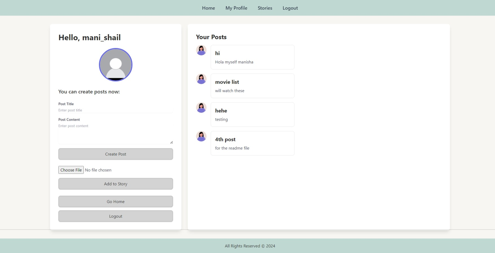
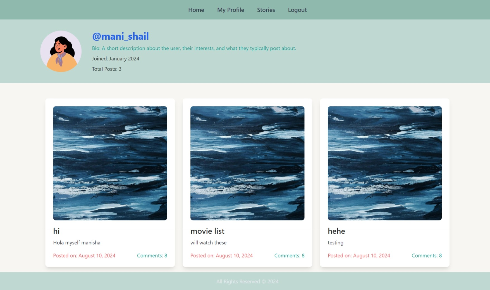
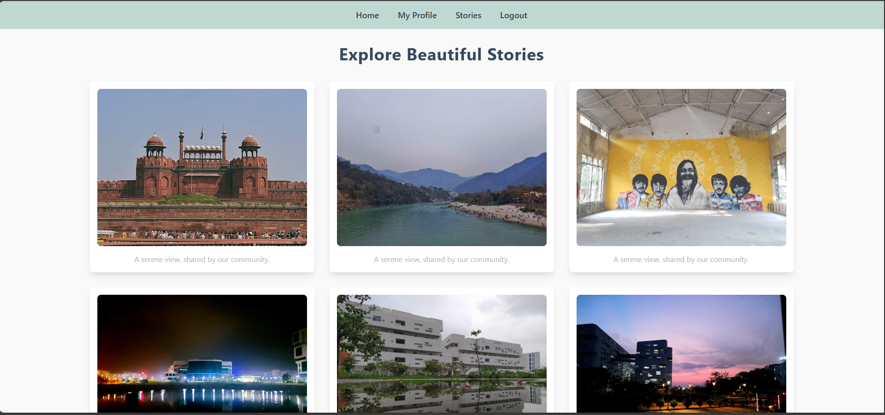

# 📱 The Socials

[Watch the Video](./public/readme/socials.mkv)
<!-- Replace with your project's image or logo -->

## 🏗️ Project Overview

The Socials is a typical modern web application designed to provide platform connect users through posts and stories. Users can create profiles, share content, and engage with others in a visually appealing environment. Built with a focus on usability and aesthetics, this platform provides a seamless user experience.

## 🌟 Key Features

- **User Profiles**: Users can create personalized profiles with avatars and bios.
- **Post Creation**: Users can share thoughts and updates through text-based posts.
- **Story Sharing**: A feature for uploading images to share anonymous temporary stories.
- **Infinite Scroll**: Allows users to scroll through posts and stories
- **Responsive Design**: Optimized for both mobile and desktop viewing.
- **Intuitive Navigation**: Easy-to-use interface for enhanced user engagement.

## 🔧 Technologies Used

### Frontend :

- **HTML**: The structure of the web pages is built using standard HTML elements, ensuring compatibility and a clear layout across all devices.
- **CSS with Tailwind CSS**: For styling, Tailwind CSS was employed, allowing for utility-first CSS design. This approach enables rapid UI development while maintaining a clean and aesthetic design. The custom color palette enhances visual appeal, providing a cohesive look throughout the application.
- **EJS (Embedded JavaScript Templates)**: Instead of using React for the frontend, EJS was utilized for server-side rendering. EJS allows for dynamic content generation by embedding JavaScript directly within HTML. This results in faster load times and SEO-friendly pages, as the content is rendered on the server and sent to the client.

### Backend :

- **Node.js**: The server-side logic is built with Node.js, allowing for a scalable and efficient runtime environment. Node.js is well-suited for handling asynchronous operations, making it a robust choice for web applications.
- **Express.js**: This framework was used to streamline the development of the web server, providing routing capabilities and middleware support for handling requests and responses.
- **MongoDB**: As a NoSQL database, MongoDB was chosen for its flexibility in handling various data structures. It stores user data, posts, and other content in a way that allows for easy retrieval and manipulation.

### File Upload and Storage :

- **Multer**: For handling file uploads, the Multer middleware is integrated, enabling users to upload images seamlessly. This feature enhances user interaction by allowing them to share visual content directly on the platform.
- **Local Storage**: Uploaded images are stored in the `/public/images` directory, making them easily accessible for display on user profiles and in story features.

### Features :

- **User Authentication**: The application includes user authentication mechanisms, ensuring that only registered users can create posts and share stories.
- **Story Feature**: Users can share ephemeral content through stories, allowing them to engage with their audience in a more dynamic manner.
- **Dynamic User Profiles**: Each user has a profile that displays their posts and relevant information, providing a personalized experience.
- interact with posts and stories from other users.

## 🚀 Getting Started

### Prerequisites

- Node.js (v14 or higher)
- MongoDB (installed and running)

### Installation Steps

1. Clone the repository:
   `git clone https://github.com/your-username/social-media-platform.git`
2. Navigate to the project directory:
   `cd social-media-platform
`
3. Install dependencies:
   `npm install`
4. Start the server:
   `npm start`
5. Open your browser and navigate to:
   `http://localhost:3000`

## 📜 How to Use

- Register: Create an account to start using the platform.
- Create Posts: Share your thoughts and experiences through posts.
- Upload Stories: Add images to your profile to share stories with your followers.
- Explore: Browse and interact with posts and stories from other users.

## 📃 License

This project is licensed under the MIT License.

## 🤝 Contributing

Contributions are welcome! Please fork the repository, make your changes, and submit a pull request.

## ✍️ Author

1. Himanshu Gupta - [GitHub Profile](https://github.com/himanshu181749/)
2. Manisha Sahu - [GitHub Profile](https://github.com/mani-sahu)
